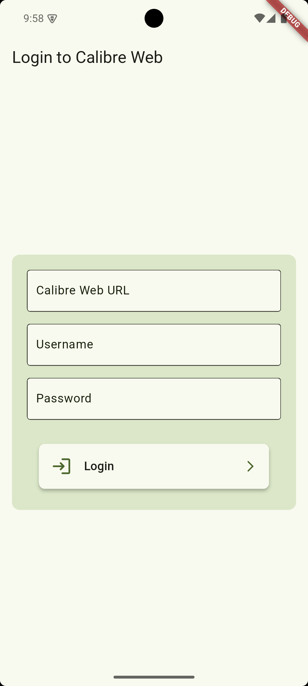
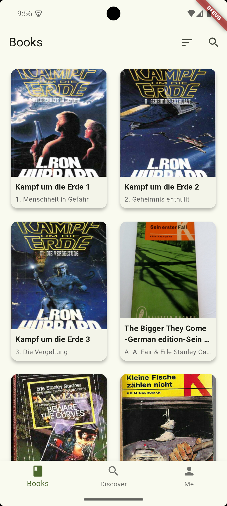
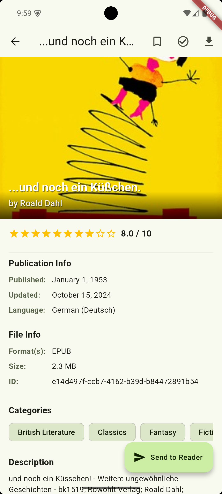
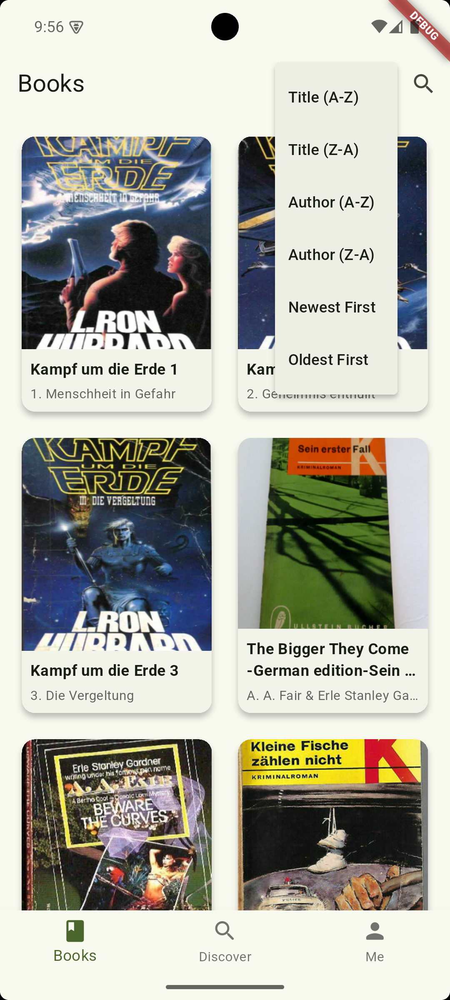
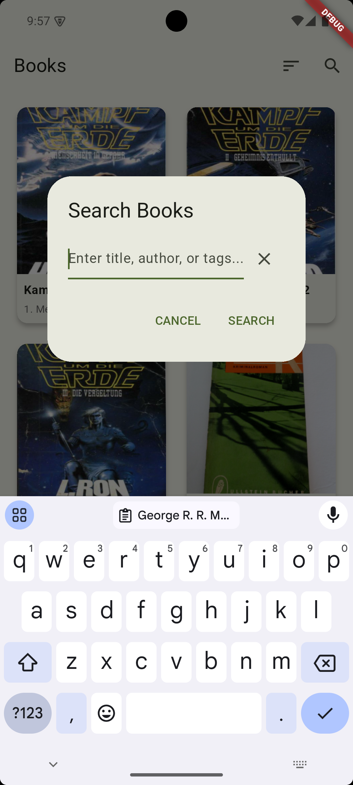
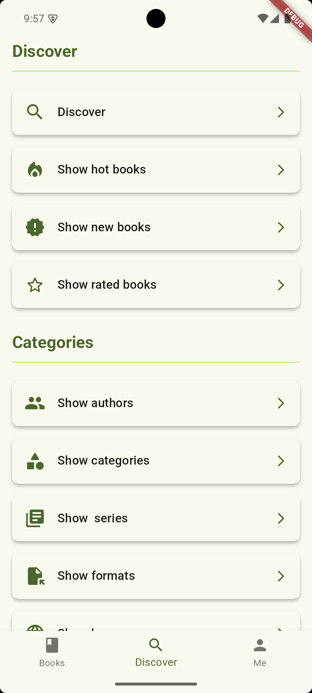
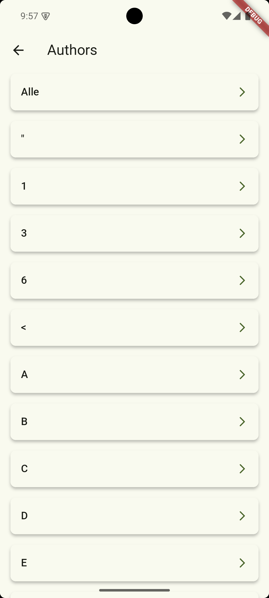
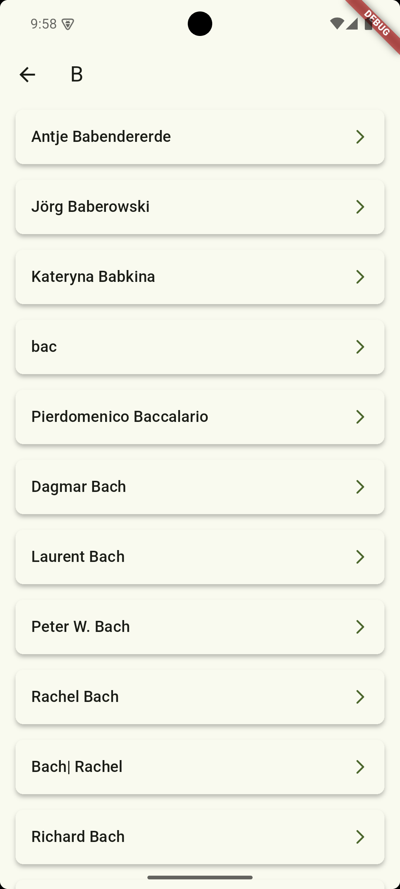
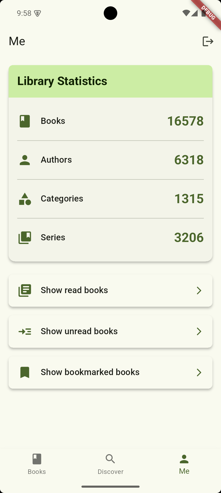

    

# Calibre Web Companion

This is an unofficial companion app for [Calibre Web](https://github.com/janeczku/calibre-web) (which also works for [Calibre Web Automated](https://github.com/crocodilestick/Calibre-Web-Automated)) that allows you to browse through your book collection and download books directly to your device. You can also interact with your books by marking them as read, unread, or bookmark. You can also send book directly to your e-reader (Kindle/Kobo) thanks to the great work of [send2ereader](https://github.com/daniel-j/send2ereader).

The app is built with [Flutter](https://github.com/flutter/flutter) and uses the **Material You**. The app is currently available for **Android** only.

## 📦 Installation

## 💪 Features

- Log in to your Calibre Web server
- Browse through your book collection
- Discover books by different categories (author, series, hot, etc.)
- Display book details
- Display collection statistics
- Download books directly to your device
- Mark books as read, unread, or bookmark
- Send books to your e-reader (using [send2ereader](https://github.com/daniel-j/send2ereader))

## 🖼️ Impressions

    
    
    
    
    
    
    
    
    

## 🚀 Contributing

You can of course open issues for bugs, feedback, and feature ideas. All suggestions are very welcome :)

## 🚧 Roadmap

- [ ] Add localization
- [ ] Add dark mode
- [ ] Code refactoring
- [ ] Better error handling

## 📜 Credits

- [Calibre Web](https://github.com/janeczku/calibre-web)
- [Calibre Web Automated](https://github.com/crocodilestick/Calibre-Web-Automated)
- [send2ereader](https://github.com/daniel-j/send2ereader)
- [Flutter](https://github.com/flutter/flutter)
- [IconKitchen](https://icon.kitchen)
