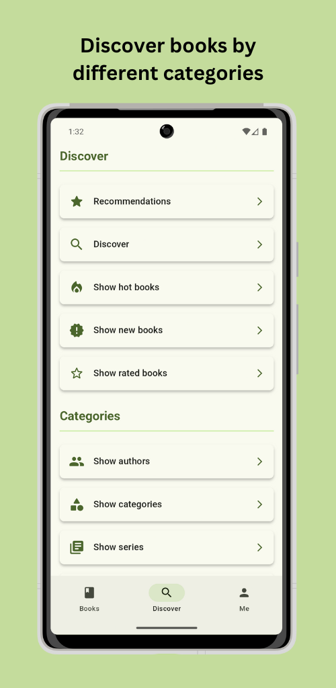

    
     
    v1.6.0

# Calibre Web Companion

This is an unofficial companion application for [Calibre Web](https://github.com/janeczku/calibre-web) (which also works for [Calibre Web Automated](https://github.com/crocodilestick/Calibre-Web-Automated)) that allows you to browse your book collection and download books directly to your device. You can also interact with your books by marking them as read, unread or bookmarked. It is also possible to send books directly to your e-reader (Kindle/Kobo) thanks to the great work of [send2ereader](https://github.com/daniel-j/send2ereader).

The app is built with [Flutter](https://github.com/flutter/flutter) and uses **Material You**. It is currently available for **Android** only.

## 📦 Installation

    
    

## 💪 Features

- Log into your Calibre Web (Automated) server.
- Enjoy seamless navigation through your book collection.
- Explore books organized by various categories, such as author, series, trending, and more.
- View detailed information about each book.
- Easily mark books as read or unread, organize them into shelves, or archive them.
- Access comprehensive collection statistics at a glance.
- Download books directly onto your device.
- Instantly send books to your e-reader using [send2ereader](https://github.com/daniel-j/send2ereader) or via Calibre Web's mail function. You can also use your own send2ereader instance.
- Automatically download books to your collection with [calibre-web-automated-book-downloader](https://github.com/calibrain/calibre-web-automated-book-downloader).
- Manage and customize your shelves.

## 🖼️ Impressions

    
    
    
    
    
    

## 🚀 Contributing

You can of course open issues for bugs, feedback, and feature ideas. All suggestions are very welcome :)

## 🚧 Roadmap

- [x] Add localization
- [x] Add dark mode
- [x] Toggle read/unread status
- [x] Add bookmark function
- [x] Calibre Web Automated Download integration
- [x] Add and remove from shelfs
- [ ] Code refactoring
- [ ] Better error handling

## 📜 Credits

- [Calibre Web](https://github.com/janeczku/calibre-web)
- [Calibre Web Automated](https://github.com/crocodilestick/Calibre-Web-Automated)
- [calibre-web-automated-book-downloader](https://github.com/calibrain/calibre-web-automated-book-downloader)
- [send2ereader](https://github.com/daniel-j/send2ereader)
- [Flutter](https://github.com/flutter/flutter)
- [IconKitchen](https://icon.kitchen)
